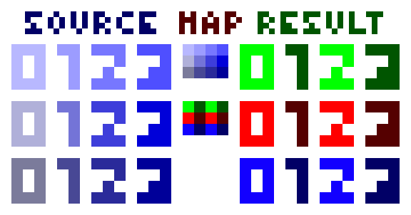

# gdx-AarthSkins

A libgdx implemented of aartificial's way on loading textures 

[](https://github.com/lyze237/gdx-AarthSkins/actions?query=workflow%3A%22Test%22)
[](https://github.com/lyze237/gdx-AarthSkins/blob/main/LICENSE)
[](https://jitpack.io/#lyze237/gdx-AarthSkins)
[](https://coffee.lyze.dev)

# How does this work?

[](https://www.youtube.com/watch?v=HsOKwUwL1bE)



| Source file | Map files | Result |

# Example

Create a file ending in `.aarth`. (For example: `Test.aarth`) and fill it with the following three lines (All paths should be relative to the `.aarth` file):
1. relative path to source file
2. relative path to map file
3. relative path to lookup file

Examples see here: https://github.com/lyze237/gdx-AarthSkins/tree/main/src/test/resources


```java
public class Example extends ApplicationAdapter {
  private Viewport viewport = new XXXViewport(xxx, xxx);
  private SpriteBatch batch;
  
  private Texture texture;
  private Animation<TextureAtlas.AtlasRegion> animation;

  public void create() {
      batch = new SpriteBatch();
      
      // https://libgdx.com/wiki/managing-your-assets
      // Loading Aarth Skin files is only implemented via an asset manager
      var assMan = new AssetManager();
      
      // Register the aarth skin texture loader
      assMan.setLoader(Texture.class, "aarth", new AarthSkinTextureLoader());
      // Tell the asset manager to load the file
      assMan.load("Test.aarth", Texture.class);
      // Tell the asset manager to finish loading everything
      assMan.finishLoading();
      
      // Get the generated texture
      texture = assMan.get("Test.aarth", Texture.class);
      
      // Alternatively loading a texture atlas:
      assMan.setLoader(TextureAtlas.class, "aarth", new AarthSkinTextureAtlasLoader());
      assMan.load("Sprite.aarth", TextureAtlas.class);
      assMan.finishLoading();

      var atlas = assMan.get("Sprite.aarth", TextureAtlas.class);
      animation = new Animation<>(0.1f, atlas.findRegions("Sprite"), Animation.PlayMode.LOOP);
  }

  public void render() {
    ScreenUtils.clear(Color.TEAL);

    viewport.apply();

    batch.setProjectionMatrix(viewport.getCamera().combined);

    batch.begin();
    batch.draw(texture, 0, 0);
    batch.end();
  }

  @Override
  public void resize(int width, int height) {
    viewport.update(width, height, true);
  }
}
```

# Installation

1. Open or create `gradle.properties` in the root folder of your project, add the following line:

```properties
gdxAarthSkinsVersion=VERSION
```

Check [Jitpack](https://jitpack.io/#lyze237/gdx-AarthSkins/) for the latest version and replace `VERSION` with that.

2. Add the jitpack repo to your build file.

```groovy
allprojects {
    repositories {
        // ...
        maven { url 'https://jitpack.io' }
    }
}
```

3. Add that to your core modules dependencies inside your root `build.gradle`

```groovy
project(":core") {
    // ...

    dependencies {
        // ...
        implementation "com.github.lyze237:gdx-AarthSkins:$gdxAarthSkinsVersion"
    }
}
```

## Html/Gwt project

1. Gradle dependency:

```groovy
implementation "com.github.lyze237:gdx-AarthSkins:$gdxAarthSkinsVersion:sources"
```

2. In your application's `.gwt.xml` file add (Normally `GdxDefinition.gwt.xml`):

```xml
<inherits name="dev.lyze.gdxAarthSkin"/>
```

## How to test

By default, if you run `./gradlew test` gradle runs headless tests. If you want to test `lwjgl` tests (so with an actual
gui), then you need to run them with `./gradlew test -Plwjgl=true`

Set environment variable `SLEEPY` to a millisecond number to sleep between each LWJGL test. (For example: SLEEPY=3000 would wait 3 seconds after every test.)
